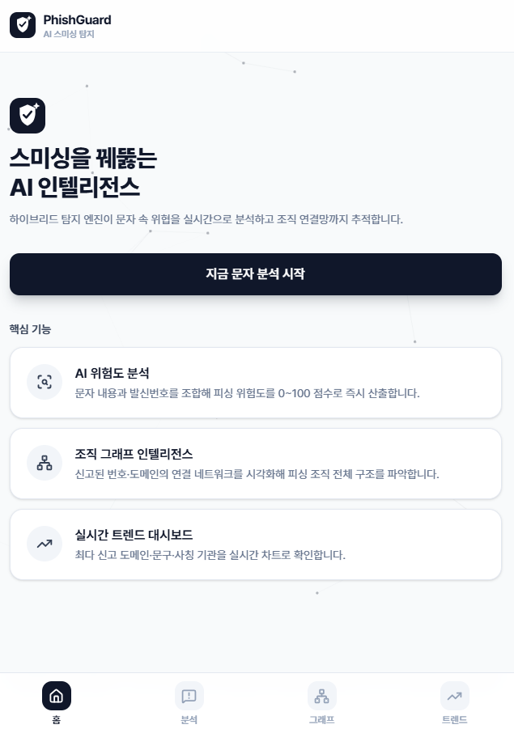
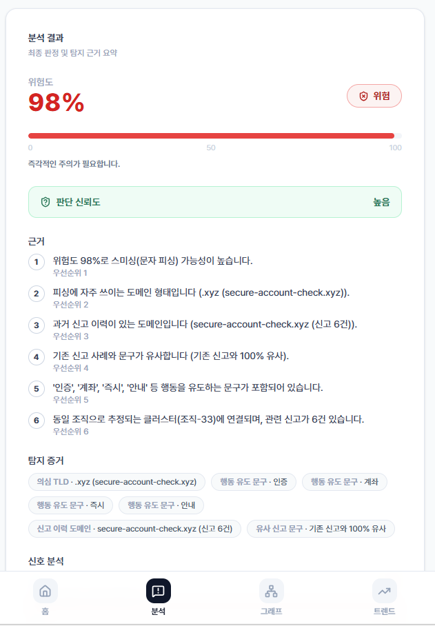
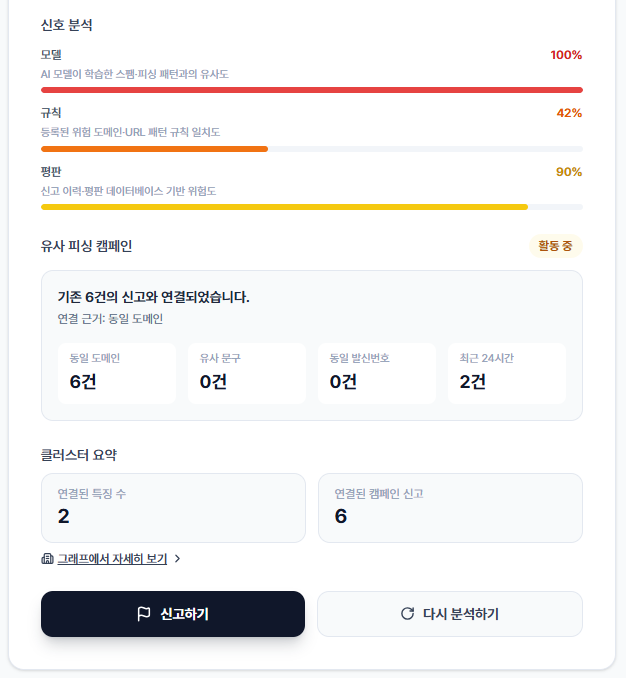
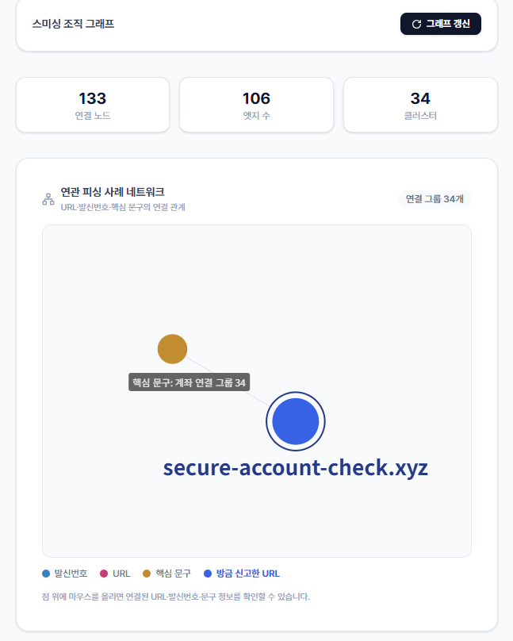
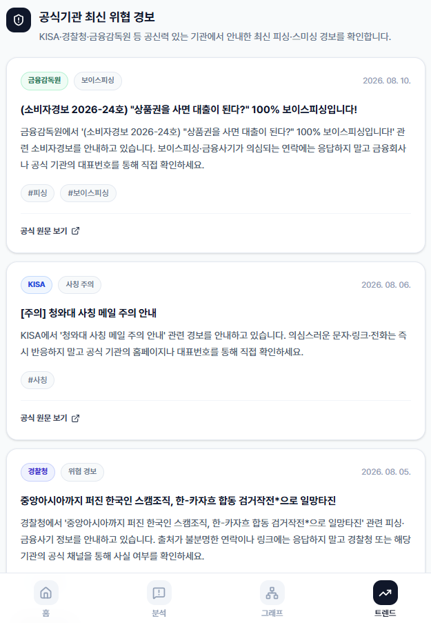

<h1 align="center">🛡️ PhishGuard</h1>

<p align="center">
  <b>AI 문맥 분석·URL 구조 분석·신고 이력·유사 사례를 결합한 피싱·스미싱 탐지 서비스</b>
</p>

<p align="center">
  위험도 · 판단 신뢰도 · 탐지 근거 · 유사 피싱 사례 추적
</p>

<p align="center">


</p>

<hr/>

단순 키워드나 AI 모델 하나의 결과에만 의존하지 않고,
**문자 문맥 · URL 구조 · 신고 이력 · 유사 사례 Graph**를 함께 분석하여
사용자에게 **위험도, 판단 신뢰도, 탐지 근거**를 제공합니다.

---

## 📌 서비스 소개

최근 피싱·스미싱 문자는 단순히 `계좌`, `인증`, `배송` 같은 위험 단어를 사용하는 수준을 넘어
**정상 안내 문자와 유사한 문맥과 표현을 활용하는 방향으로 정교해지고 있습니다.**

PhishGuard는 이를 해결하기 위해 하나의 탐지 방식이 아닌 여러 독립 신호를 함께 활용합니다.

```text
피싱 문자 입력
        ↓
전처리 · URL 추출
        ↓
┌──────────────────────────────┐
│ ① AI 문맥 분석              │
│ ② 문자·URL 구조 분석        │
│ ③ 신고 이력·평판 정보       │
│ ④ 유사 피싱 사례 Graph      │
└──────────────────────────────┘
        ↓
   Multi-Signal Fusion
        ↓
위험도 · 판단 신뢰도 · 탐지 근거
```

---

# ✨ 주요 기능

## 1. AI 문맥 기반 피싱 탐지

**KcELECTRA 기반 문자 분류 모델**을 활용하여
단순 키워드 포함 여부가 아닌 전체 문맥을 기준으로 정상·피싱 가능성을 분석합니다.

또한 일반 Validation 성능만 확인하지 않고,

* 정상인데 피싱처럼 보이는 문자
* 피싱인데 정상처럼 보이는 문자
* Hard Negative
* 고난도 피싱 사례
* 기존 모델 오분류 사례

등을 추가로 구성하여 모델을 반복적으로 개선했습니다.

---

## 2. URL 구조 기반 위험 분석

기존 악성 URL DB에 등록된 주소뿐 아니라
**처음 등장한 URL도 구조적 특징을 분석하여 위험도를 판단**합니다.

주요 분석 항목:

* URL 길이
* 서브도메인 수
* 숫자·특수문자 비율
* 의심 TLD
* Punycode·IP 주소 사용
* 단축 URL 여부
* 도메인 구조
* 문자 패턴

총 **35개의 URL 구조 특징**을 분석합니다.

```text
URL 입력
   ↓
악성 URL 신고 이력 확인
   +
35개 URL 구조 특징 분석
   ↓
URL Rule Engine
   ↓
구조적 위험 점수 산출
```

---

## 3. 다중 신호 기반 종합 판단

PhishGuard는 AI 모델 점수 하나만으로 최종 결론을 내리지 않습니다.

### ① AI 문맥 분석

기본 피싱 위험도 산출

### ② 문자·URL 규칙 분석

유도 문구, 단축 URL, 의심 도메인 등 추가 위험 신호 확인

### ③ 신고 이력 분석

기존 사용자 신고 및 악성 도메인 이력을 위험 판단에 반영

### ④ 유사 피싱 사례 연결

도메인, 발신번호, 핵심 문구를 기반으로 기존 신고 사례와의 관계 분석

각 신호를 종합하여 최종적으로 다음 정보를 제공합니다.

* **위험도**
* **판단 신뢰도**
* **탐지 근거**
* **추가 검토 필요 여부**

---

## 4. AI 판단 신뢰도 평가

**높은 위험도와 높은 판단 신뢰도를 동일하게 취급하지 않습니다.**

AI 모델이 높은 피싱 가능성을 예측했더라도
규칙, 신고 이력, 유사 사례 등의 보조 근거가 부족하면
최종 판단의 신뢰도를 낮추고 사용자에게 추가 확인을 안내합니다.

예를 들어,

```text
AI 모델       : 높은 위험
URL/문자 규칙 : 근거 부족
신고 이력     : 없음
유사 사례     : 없음
```

이라면 모델의 높은 예측값만 그대로 사용자에게 전달하지 않고
**판단 신뢰도 '낮음' + 추가 확인 필요**로 안내합니다.

---

## 5. 신고 기반 유사 피싱 사례 추적

사용자가 피싱 의심 문자를 신고하면 신고 이력이 데이터베이스에 저장됩니다.

신고된 사례의

* 도메인
* 발신번호
* 핵심 문구

를 연결하여 **유사 피싱 사례 네트워크**를 구성합니다.

동일하거나 강하게 연관된 정보가 반복될 경우
개별 문자뿐 아니라 연결된 신고 사례까지 함께 확인할 수 있습니다.

---

## 6. 신고 검증 및 재학습 데이터 관리

반복 신고가 발생한 사례는 `case_key` 기준으로 하나의 사례로 관리합니다.

```text
1회 신고
→ pending

2~4회 반복 신고
→ suspected

5회 이상 반복 신고
→ confirmed(검토 대상 사례)
confirmed 사례는 바로 모델에 학습하지 않고, 검토 후 training_approved와 라벨을 부여한 사례만 재학습 데이터 후보로 사용합니다.
```

동일한 문자가 반복 신고되더라도 학습 데이터에서는
**동일 `case_key`를 하나의 고유 사례로 처리**하여 중복 학습을 방지합니다.

검증된 신규 사례는 기존 학습 데이터와 함께 재학습 후보 데이터로 활용할 수 있도록 구성했습니다.

---

## 7. 우회형 피싱 문자 대응 테스트

탐지 시스템을 우회하려는 문자 변형에도 대응할 수 있는지 확인하기 위해
대표적인 변형 패턴을 별도로 테스트합니다.

예시:

```text
계좌 → 계ㅈㅘ
계좌 → 계jwa
http:// → hxxp://
.xyz → [.]xyz
```

테스트 유형:

* 공백 삽입
* 특수문자 삽입
* 한·영문 혼용
* URL 난독화
* 한글 자모 분리

변형 문자도 기존 문자와 동일한 분석 파이프라인을 통해 다시 분석합니다.

---

## 8. 공식기관 최신 피싱 정보 연동

서비스 내부 신고 데이터뿐 아니라 외부의 최신 위험 정보도 함께 제공합니다.

연동 기관:

* **KISA**
* **경찰청**
* **금융감독원**

공식기관에서 제공하는 최신 피싱·스미싱 관련 정보를
**30분 주기로 갱신**하여 서비스 내부에서 확인할 수 있도록 구성했습니다.

---

# 🖥️ 서비스 화면

## 🏠 메인 화면

문자 내용을 입력하고 바로 피싱 위험 분석을 시작할 수 있습니다.

<p align="center">
  
</p>

---

## 🔍 피싱 문자 분석

입력된 문자를 AI 문맥 분석, URL 구조 분석, 신고 이력 등 여러 신호를 통해 분석합니다.

<p align="center">
  
</p>

분석 결과에서 단순 피싱 여부뿐 아니라
**위험도와 판단 신뢰도, 탐지 근거**를 함께 제공합니다.

<p align="center">
  
</p>

---

## 🚨 사용자 신고

피싱으로 의심되는 문자는 서비스 내부 신고 DB에 저장할 수 있습니다.

또한 사용자가 직접 신고를 진행할 수 있도록
**KISA 공식 신고 채널로 이동하는 기능**을 제공합니다.

<p align="center">
  
</p>

> PhishGuard가 KISA에 신고를 자동 전송하는 방식이 아니라,
> 사용자가 공식 신고 채널로 이동할 수 있도록 연결합니다.

---

## 🕸️ 유사 피싱 사례 Graph

기존 신고 사례의 도메인, 발신번호, 핵심 문구를 기반으로
연관된 사례를 그래프로 확인할 수 있습니다.

<p align="center">
  
</p>

이를 통해 하나의 문자만 확인하는 것이 아니라
**기존에 신고된 유사 사례와의 연결 관계까지 함께 확인**할 수 있습니다.

---

## 📢 최신 피싱 동향

KISA·경찰청·금융감독원의 공식 피싱·스미싱 정보를 서비스 내에서 확인할 수 있습니다.

<p align="center">
  
</p>

---

# 🏗️ System Architecture

```text
사용자 문자 입력
        │
        ▼
┌─────────────────┐
│   Preprocessing │
│   URL Extraction│
└────────┬────────┘
         │
         ▼
┌──────────────────────────────────┐
│          Detection Layer         │
│                                  │
│  AI Context Classification       │
│  Text / URL Rule Engine          │
│  Reputation Analysis             │
│  Similar-case Graph              │
└──────────────┬───────────────────┘
               │
               ▼
       Multi-Signal Fusion
               │
               ▼
┌──────────────────────────────────┐
│ Risk Score                       │
│ Confidence                       │
│ Evidence                         │
│ Review Required                  │
└──────────────┬───────────────────┘
               │
      ┌────────┴────────┐
      ▼                 ▼
사용자 결과 제공       사용자 신고
                        │
                        ▼
                신고 이력 DB 저장
                        │
                        ▼
                 Graph 갱신
```

---

# 🧠 Detection Pipeline

```text
preprocess
    ↓
AI classifier
    ↓
text rules
    ↓
URL rule engine
    ↓
reputation
    ↓
similar-case graph
    ↓
multi-signal fusion
    ↓
confidence / review check
    ↓
explanation
```

---

# 🛠️ Tech Stack

### AI / Data

* Python
* PyTorch
* Transformers
* KcELECTRA
* scikit-learn
* pandas
* NumPy

### Backend

* FastAPI
* SQLite
* Uvicorn

### Frontend

* React
* Vite
* JavaScript
* Tailwind CSS
* Lucide React

### Visualization

* Graph-based phishing case visualization
* Threat trend visualization

---

# 📂 주요 프로젝트 구조

```text
is-this-phishing-ai/
│
├── ai/
│   ├── classifier.py
│   ├── fusion.py
│   ├── preprocess.py
│   ├── url_rule_engine.py
│   └── src/
│
├── backend/
│   ├── analyze.py
│   ├── explain.py
│   ├── graph.py
│   ├── main.py
│   ├── reputation.py
│   ├── retraining.py
│   ├── rules.py
│   ├── threat_feed.py
│   └── trends.py
│
├── frontend/
│   └── src/
│       ├── components/
│       └── pages/
│
├── docs/
│   └── images/
│
└── README.md
```

---

# 🚀 실행 방법

## 1. Repository Clone

```bash
git clone <repository-url>
cd is-this-phishing-ai
```

## 2. Python 가상환경 활성화

Windows PowerShell:

```powershell
Set-ExecutionPolicy -Scope Process -ExecutionPolicy RemoteSigned
.\.venv\Scripts\Activate.ps1
```

## 3. Backend 실행

```bash
python -m uvicorn backend.main:app --reload
```

Backend API:

```text
http://localhost:8000
```

Swagger:

```text
http://localhost:8000/docs
```

## 4. Frontend 실행

새 터미널에서:

```bash
cd frontend
npm install
npm run dev
```

Frontend:

```text
http://localhost:5173
```

---

# 🔌 주요 API

| API                | 기능             |
| ------------------ | -------------- |
| `/api/analyze`     | 문자 피싱 위험 분석    |
| `/api/report`      | 사용자 신고 저장      |
| `/api/graph`       | 유사 피싱 사례 Graph |
| `/api/trends`      | 피싱 신고 및 최신 동향  |
| `/api/adversarial` | 우회형 문자 변형 테스트  |

---

# 💡 PhishGuard의 차별점

### 01. 단일 AI 모델에 의존하지 않는 탐지

AI 문맥 분석뿐 아니라 URL 규칙, 신고 이력, 유사 사례를 함께 판단합니다.

### 02. 위험도와 판단 신뢰도의 분리

AI 모델이 높은 위험도를 출력하더라도 보조 근거가 부족하면 낮은 신뢰도로 안내합니다.

### 03. DB에 없는 신규 URL 탐지

기존 악성 URL 목록에 없는 주소도 구조적 특징을 분석합니다.

### 04. 신고 데이터의 재활용

반복 신고 사례를 검증하고 중복 제거하여 향후 모델 개선에 활용할 수 있도록 구성했습니다.

### 05. 개별 문자를 넘어 유사 사례까지 연결

도메인·발신번호·핵심 문구를 기반으로 연관된 신고 사례를 Graph로 연결합니다.

### 06. 공식기관 최신 정보 연동

KISA·경찰청·금융감독원의 최신 피싱·스미싱 정보를 서비스 안에서 함께 확인할 수 있습니다.

---

# 🎯 Project Goal

PhishGuard의 목표는 단순히 문자 한 건을 **“피싱 / 정상”**으로 분류하는 것에 그치지 않습니다.

**왜 위험한지 설명하고,
얼마나 믿을 수 있는 판단인지 알려주며,
새로운 신고와 유사 사례를 다음 탐지에 다시 활용하는 피싱 대응 서비스**를 구현하는 것을 목표로 합니다.

---

## 🛡️ PhishGuard

**하나의 모델이 아닌, 여러 탐지 신호를 함께 판단합니다.**
